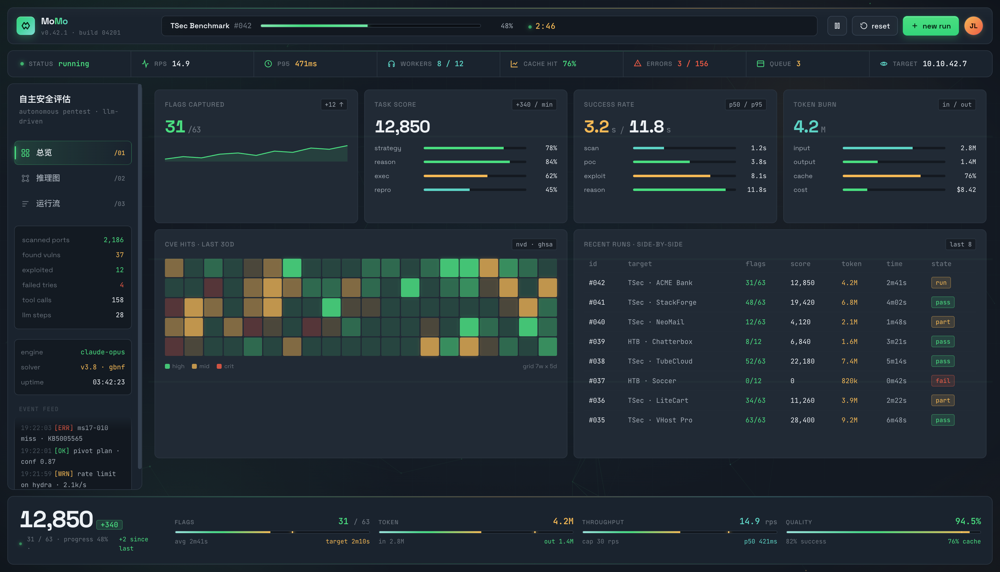
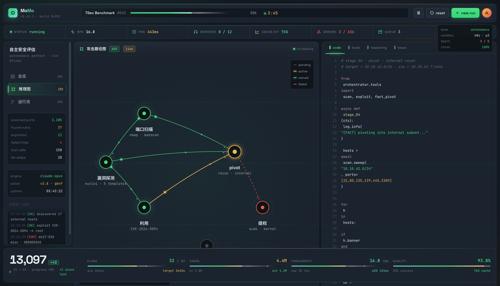
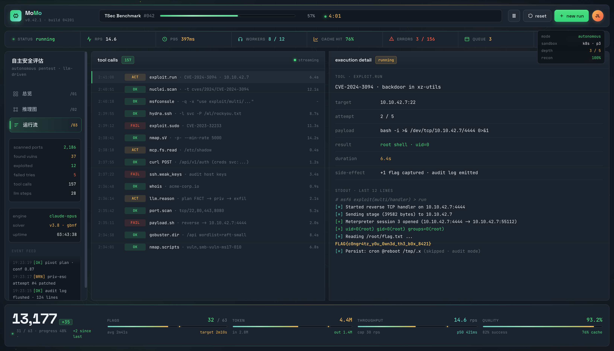
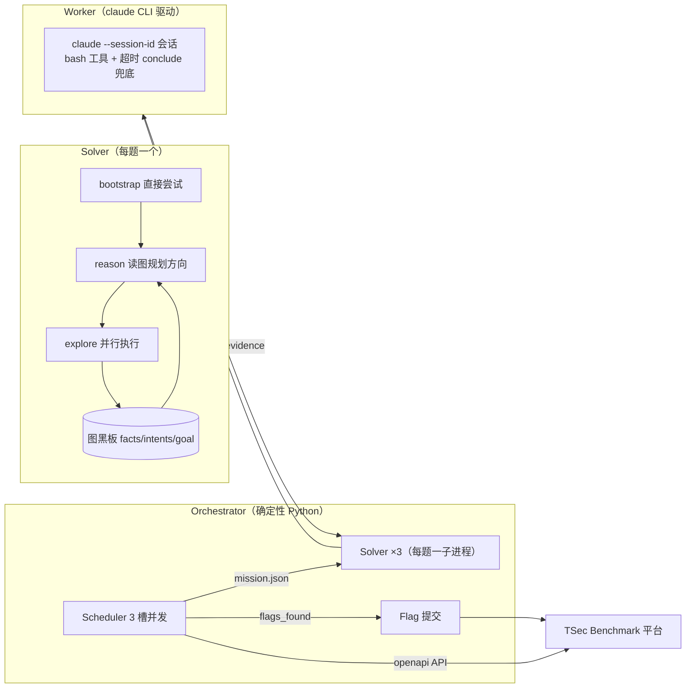

<div align="center">

<div style="background: #0B0E14; padding: 56px 64px 40px 64px; border-radius: 8px; font-family: -apple-system, BlinkMacSystemFont, 'Segoe UI', 'PingFang SC', sans-serif; color: #F5F1E8;">

<h1 style="font-size: 64px; font-weight: 800; color: #F5F1E8; margin: 0 0 16px 0; letter-spacing: 0.5px;">MoMo-agent</h1>

<p style="font-size: 22px; color: #C9C5BC; margin: 0 0 4px 0; font-weight: 600;">图黑板搜索驱动的自主安全评估 Agent</p>
<p style="font-size: 16px; color: #8A93A6; margin: 0 0 28px 0; font-family: ui-monospace, SFMono-Regular, Menlo, Consolas, monospace;">Blackboard-search-driven autonomous security agent</p>

<p style="font-size: 20px; margin: 0 0 24px 0; line-height: 1.6;"><span style="color:#8A93A6; font-weight:400; font-family: ui-monospace, SFMono-Regular, Menlo, Consolas, monospace;">给目标</span>&nbsp;&nbsp;<span style="color:#5C6370; font-weight:400; font-family: ui-monospace, SFMono-Regular, Menlo, Consolas, monospace;">→</span>&nbsp;&nbsp;<span style="color:#8A93A6; font-weight:400; font-family: ui-monospace, SFMono-Regular, Menlo, Consolas, monospace;">两轮调度</span>&nbsp;&nbsp;<span style="color:#5C6370; font-weight:400; font-family: ui-monospace, SFMono-Regular, Menlo, Consolas, monospace;">→</span>&nbsp;&nbsp;<span style="color:#FF6BCB; font-weight:700; font-family: ui-monospace, SFMono-Regular, Menlo, Consolas, monospace;">证据链</span>&nbsp;&nbsp;<span style="color:#5C6370; font-weight:400; font-family: ui-monospace, SFMono-Regular, Menlo, Consolas, monospace;">→</span>&nbsp;&nbsp;<span style="color:#8A93A6; font-weight:400; font-family: ui-monospace, SFMono-Regular, Menlo, Consolas, monospace;">出结论</span></p>

<p style="font-size: 16px; color: #8A93A6; margin: 0 0 28px 0; line-height: 1.7;">ReAct + 图黑板搜索，证据驱动防误报，全自动解题。</p>

<p style="font-size: 14px; color: #5C6370; margin: 0; font-family: ui-monospace, SFMono-Regular, Menlo, Consolas, monospace; letter-spacing: 0.5px;">
<strong style="color:#FF6BCB;">2</strong> 轮调度 &nbsp;·&nbsp; <strong style="color:#FF6BCB;">100%</strong> 证据驱动 &nbsp;·&nbsp; <strong style="color:#FF6BCB;">0</strong> 幻觉
</p>

<p style="font-size: 13px; color: #5C6370; margin: 8px 0 0 0; font-family: ui-monospace, SFMono-Regular, Menlo, Consolas, monospace;">Python · Claude · 证据链 / 防幻觉</p>

</div>

<br/>

## stacks

<div align="center">
  
</div>


<div align="center">
  
</div>

<br/>

<sub>ReAct + Blackboard Search · 两轮制调度 · 证据链防误报</sub>

<p align="center">
  <b>图黑板搜索驱动的自主安全评估 Agent</b><br/>
  面向 CTF / 漏洞评估场景 · 全自动解题 · 两轮制调度 · 证据驱动防误报
</p>

<p align="center">
  <a href="https://github.com/Dest1ny-Sec/MoMo-agent/blob/main/LICENSE"></a>
  <a href="https://github.com/Dest1ny-Sec/MoMo-agent/stargazers"></a>
  <a href="https://github.com/Dest1ny-Sec/MoMo-agent/actions"></a>
  <a href="https://www.python.org"></a>
  <a href="http://59.110.23.216:13231/demo.html"></a>
</p>

<br/>

---

> 🔗 **在线演示**：http://59.110.23.216:13231/demo.html

---

## 🖥 演示

> 🔗 **在线演示**：http://59.110.23.216:13231/demo.html

<p align="center">
  
</p>

<p align="center">
  
</p>

<p align="center">
  
</p>

> 前端是 Vue3 实时面板，展示 MoMo 的**运行态**：题目进度、维度攻克率、得分趋势、核心的**推理图**（facts → intents → goal 黑板搜索），以及 agent 的**实时动作流**。

---

## 🧭 它是什么

**MoMo** 是一个面向 **CTF / 漏洞评估** 的自主 Agent 框架。给定一组题目和靶场入口，它能：

- **批量并发**处理远超人工上限的题目量（3 槽并行，自动拉题→解题→提交→关容器）
- **持续迭代**：采用**两轮制**——第一轮每题最多 20 分钟，没解出就关容器保存进度，等所有题都尝试过一遍后，**第二轮重试**没做出来的
- **全程自主**：bootstrap 直接尝试 → reason 规划方向 → explore 执行探索，循环直到拿全 flag

MoMo 把"渗透解题"建模为一次**状态空间搜索**：从 `origin` 出发，通过 `intent`（探索方向）不断产生 `fact`（已确认的客观发现），最终通向 `goal`（拿全 flag 并提交成功）。

---

## ✨ 为什么不一样

| 特性 | MoMo | 传统 agent 循环 |
|---|---|---|
| **图黑板推理** | facts/intents/goal 显式建图，reason 读全图规划，不遗忘 | 上下文里丢信息，容易漂移 |
| **两轮制调度** | 每题 20 分钟上限，未解出保存进度，全部尝试后第二轮重试 | 超时即永久放弃，或死磕卡死 |
| **证据驱动防误报** | flag 必须来自命令真实输出（evidence 文件），防 AI 编造刷屏 | 模型说啥都信，乱提交 |
| **Claude 会话驱动** | `claude --session-id` 持久会话 + 超时 conclude 兜底，partial 发现不丢 | 每次冷启动，超时全丢 |
| **并行深挖** | 题内多方向并行 explore + 题间 3 槽并发 | 串行一次一条 |
| **人机可干预** | 控制接口可暂停/恢复/调优先级 | 只能重启改配置 |

---

## 💡 创新点

### 1. 多 Fact 堆积 + 攻击链拼接（核心）
MoMo 把"渗透解题"显式建模为一张**事实-意图搜索图**：
- **多 Fact 堆积**：每条已确认的客观发现（`fact`）都被持久化进图黑板，随探索不断累积。与"单会话里丢上下文"的 agent 不同，MoMo 的 fact 库越积越厚，跨阶段不遗忘。
- **攻击链拼接**：Reason 阶段**读全图**，把分散的 fact 通过意图（`intent`）按因果关系**自动拼接成完整攻击链**——从 `origin`（侦察 → 指纹）→ 注入点定位 → 绕过/利用 → 提权 → 拿到 flag，整条链在图上一目了然，任何一环失败都有据可查、可换方向。

### 2. 两轮制不放弃调度
每题 20 分钟上限，未解出**保存进度**关容器换下一题；所有题尝试过一遍后，**第二轮重试**未解的。既保证题量吞吐，又不放弃任何一道。

### 3. 证据驱动防误报
flag 必须出现在**命令真实输出**（evidence 文件）里才上报，模型自述不算数；配合提交端二次校验，根治"AI 编 flag 刷屏"。

### 4. 会话级探索 + 超时回收
探索用持久 LLM 会话（`--session-id`）驱动，可连续执行多步工具调用；**超时/失败时用 conclude 兜底**恢复会话，强制回收已确认的 partial 发现，白跑不白费。

### 5. 知识库驱动的策略注入
纯通用解题知识库（WAF 绕过/沙箱逃逸/逆向方法论等），探索前自动匹配同类题打法，不手搓不重蹈覆辙。

---

## 🏗 架构



**核心流程**（MoMo 图搜索）：

1. **bootstrap**：新题直接尝试，读题面 → 按攻击面推进
2. **reason**：读全图（facts/intents/goal），复盘进展/瓶颈/空档，提出新方向
3. **explore**：并行执行方向，命令输出写 evidence，新发现落 fact
4. **两轮制**：每题 20 分钟，未解出进重试队列，全部尝试后第二轮重试

---

## 🚀 快速开始

### 1. 配置

```bash
# 平台凭证
export BENCHMARK_TOKEN="你的token"
export BENCHMARK_BASE_URL="https://tsecbench.zc.tencent.com"
# LLM（claude 会话驱动）
export ANTHROPIC_AUTH_TOKEN="sk-..."
export ANTHROPIC_MODEL="deepseek-v4-flash"
```

### 2. 本地 mock 联调（零成本）

```bash
python3 scripts/mock_bench.py &      # 起 mock 平台 + 3 道靶场
python3 -m orchestrator.main --adapter mock --no-precheck --no-server --auto-exit
```

### 3. 真实跑分

```bash
./run.sh real
```

### 4. 人机控制接口（运行中干预）

```bash
# 暂停 / 恢复 / 优先级
curl -X POST http://127.0.0.1:8800/api/control/pause    -d '{"code":"a-05"}'
curl -X POST http://127.0.0.1:8800/api/control/resume   -d '{"code":"a-05"}'
curl -X POST http://127.0.0.1:8800/api/control/priority -d '{"code":"a-05","priority":9}'
```

---

## 📦 目录结构

```
MoMo/
├── orchestrator/       # 确定性调度层（TSec API / 3 槽并发 / 提交 / 两轮制）
│   ├── scheduler.py
│   ├── scheduler_*.py  # 控制/进程/回收/提交 分模块
│   └── server.py       # 前端面板 + 控制接口
├── solver/             # 每题一子进程的图搜索求解器
│   ├── loop*.py        # bootstrap / reason / explore 分阶段
│   ├── graph.py        # facts/intents/goal 黑板
│   ├── contracts.py    # 严格 JSON 契约
│   └── worker*.py      # claude CLI 会话驱动（session + conclude 兜底）
├── adapters/           # 平台适配层（tsec / mock）
├── knowledge/          # 纯通用解题知识库（WAF 绕过/沙箱逃逸/逆向…）
├── frontend/           # Vue3 实时面板（总览/推理图/运行流/题目）
├── scripts/            # mock 平台 / VPN / 工具脚本
└── config.json
```

---

## 🔒 设计原则

- **证据优先**：flag 必须出现在命令真实输出（evidence）里，模型自述不作数
- **提交只由编排器做**：solver 子进程剥离提交凭证，杜绝模型乱提交耗配额
- **两轮制不放弃**：每题 20 分钟 + 保存进度 + 全部尝试后重试，最后才放弃
- **纯通用知识库**：只含方法论，不含任何具体题目答案

---

## 📄 License & 声明

- 本项目仅用于**授权环境**的安全评估 / CTF 竞赛 / 漏洞研究
- 请勿用于未授权目标；使用者需自行承担合规责任
- AGPL-3.0

---

<p align="center"><sub>MoMo · 自主安全评估 Agent · TSec Benchmark</sub></p>
